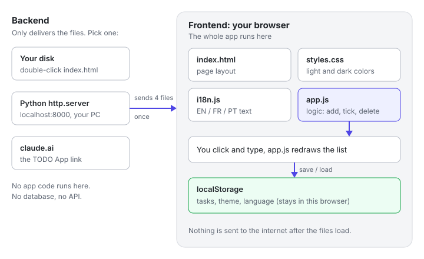

# TODO App

A simple TODO web app built with plain HTML, CSS and JavaScript. There is nothing to install and no build step: clone the repo and open it in a browser, or run the small built-in server to get user accounts.

## Features

- Add, complete and delete tasks
- Filter by All, Active or Completed, and clear completed tasks
- Dark and light theme toggle (🌙 / ☀️ button)
- Language switcher: English, French, Portuguese, Spanish and Polish
- Tasks, theme and language are saved in your browser (localStorage), so they are still there after a reload
- Optional accounts: run `npm start` and each person signs in to their own task list, stored on the server, with email confirmation and password reset

## Project structure

```
index.html   Page layout
styles.css   Styles for the light and dark themes
i18n.js      Translations (English, French, Portuguese, Spanish, Polish)
app.js       App logic
server/      Optional server for accounts (built-in Node modules only)
tests/       Automated tests (npm test)
docs/        Developer documentation and architecture diagrams
```

For a detailed description of the code, see the [developer documentation](docs/DEVELOPER.md).

## How it works



Opened as a file or from any static server, the whole app runs in your browser. Whatever opens it (the file on your disk, a local server, or a hosting site) only delivers the four files, and tasks, theme and language are saved in the browser's localStorage. The diagrams below show this mode.

Run with `npm start` instead, and the page notices the server and switches to account mode: people sign in, and their tasks are kept on the server. See [Accounts](#accounts).

### App anatomy

**File load order.** `index.html` pulls in the other files in a fixed order. `i18n.js` defines the `TRANSLATIONS` global before `app.js` runs, so swapping those two script tags would break the app. `app.js` then finds its elements in the page and is the only file that writes saved data. It reads all three keys, and a small inline script in `index.html` reads `todo-theme` early to avoid a flash of the wrong colors.


**From click to screen and storage.** Every action changes a variable in memory first, then saves it and redraws the screen from that variable. The screen is never built from `localStorage`, which is read once when the page loads. The filter is the exception to saving: it lives in memory only, so a reload returns to All.


**Life of a task.** A task is one object whose only changing field is `done`. Because each transition saves `todo-items` before redrawing, a reload brings every task back in the state it was in. Clear completed removes all Done tasks at once; the ✕ button removes a single task from either state.


## Run it from a terminal

Clone the repository:

```bash
git clone https://github.com/ArtistaVeKaras/claude-code--todoapp.git
cd claude-code--todoapp
```

**Option 1: open the file directly**

```bash
# macOS
open index.html
# Linux
xdg-open index.html
# Windows (PowerShell or cmd)
start index.html
```

**Option 2: run a small local server** (any one of these works)

```bash
python3 -m http.server 8000
# or, if you have Node.js
npx serve .
```

Then open http://localhost:8000 (or the address `npx serve` prints) in your browser. Press `Ctrl+C` in the terminal to stop the server.

## Accounts

To give each person their own task list, start the built-in server instead. It needs [Node.js](https://nodejs.org) 22.13 or newer and nothing else; there are no packages to install.

```bash
npm start
```

Open http://localhost:3000, choose **No account yet? Create one**, and sign in. In development, confirmation and password-reset emails are printed in the terminal; open the link from there.

Tasks are stored in `data/todo.db` (a SQLite file, not committed). For running it on the internet, settings such as `APP_URL` and `NODE_ENV=production`, and how the security works, see [Accounts and the server](docs/DEVELOPER.md#accounts-and-the-server).

## Tests

```bash
npm test
```

This runs the server, account and translation tests with Node's built-in test runner.

## Run it from Claude Code

Start Claude Code in the project folder:

```bash
cd claude-code--todoapp
claude
```

Then ask it in plain words, for example:

> Start a local server for this app and give me the URL

Claude Code will start a server such as `python3 -m http.server 8000` in the background, and you can open http://localhost:8000 in your browser. You can also just ask it to "open index.html in my browser".

This repo includes a project skill, [`run-todo-app`](.claude/skills/run-todo-app/SKILL.md), that tells Claude Code exactly how to do this. You can also run it directly by typing `/run-todo-app`.

## Adding a language

1. Open `i18n.js`, copy the `en` block and translate each value.
2. Add a matching `<option>` to the language select in `index.html`.
